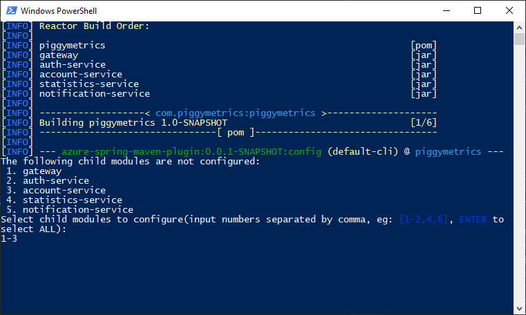
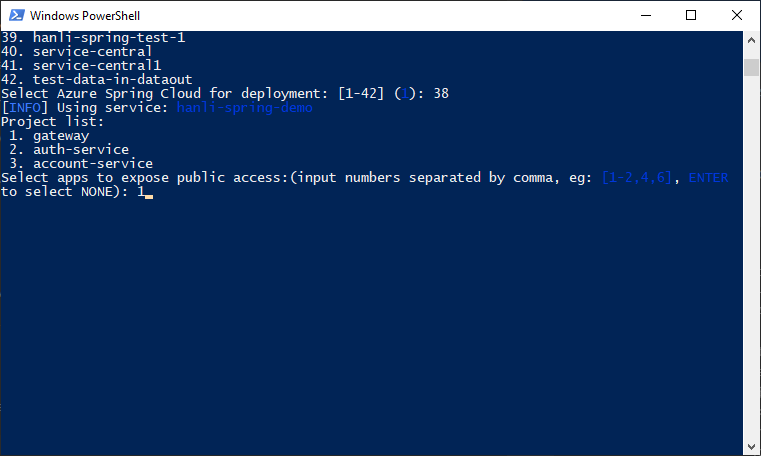

# Azure Spring Cloud Maven Plugin Quick Start

Azure Spring Cloud Maven Plugin helps you easily create and update Azure Spring Cloud Services.
 This plugin enables clean integration between CI/CD pipelines and the Azure Spring Cloud Service.

> NOTE:
>
> Look out for more features after the initial Private Preview announcement.

### Preconditions

- Azure Subscription, which has been whitelisted to access Azure Managed
  Service for Spring Cloud.  When you have been added to the whitelist,
  you will receive an email containing a link to the service landing
  page.  Save this email!

- JDK 8 or above installed on your local machine

- Maven 3.0 and above installed on your local machine

- Use the link from the "Welcome to Azure Spring Cloud" email to
  provision the Service instance as described in [Provision a service
  instance on the Azure
  portal](https://docs.microsoft.com/en-us/azure/spring-cloud/spring-cloud-quickstart-launch-app-maven#provision-a-service-instance-on-the-azure-portal).

- Using `https://github.com/xscript/piggymetrics-config` as the config URI, set the configuration server as described in [Set up your configuration server](https://docs.microsoft.com/en-us/azure/spring-cloud/spring-cloud-quickstart-launch-app-maven#set-up-your-configuration-server).  Return to this document after receiving the "Successfully updated Config Server" message.

- Ensure that the environment that will be running the `mvn` commands is
  logged in to Azure at the command line, and that the currently active
  subscription is the one that has been whitelisted.  You may need to call [`az account set`](https://docs.microsoft.com/en-us/cli/azure/account?view=azure-cli-latest#az-account-set).

### Build and Deploy microservices applications

1. Clone git repository by running below command.
    ```
    git clone https://github.com/xscript/PiggyMetrics
    ```
  
1. Change to the directory and build the project by running the below command.
    ```
    cd PiggyMetrics
    mvn clean package -DskipTests
    ```
1. Add the following configurations in your pom.xml or setting.xml to access plugin snapshot.
    ```
    <pluginRepositories>
      <pluginRepository>
        <id>maven.snapshots</id>
        <name>Maven Central Snapshot Repository</name>
        <url>https://oss.sonatype.org/content/repositories/snapshots/</url>
        <releases>
          <enabled>false</enabled>
        </releases>
        <snapshots>
          <enabled>true</enabled>
        </snapshots>
      </pluginRepository>
    </pluginRepositories>
    ```
    
1. Generate configuration by running the below command.  These maven commands will prompt for input, so be ready for that!
    ```
    mvn com.microsoft.azure:azure-spring-cloud-maven-plugin:0.1.0-SNAPSHOT:config
    ```
    1. Select module `gateway`,`auth-service` and `account-service`

        

    1. Select your subscription and spring cloud service cluster

    1. Expose public access to gateway

        
    
    1. Confirm the configuration

1. Deploy the above apps with the following command

    ``` 
    mvn com.microsoft.azure:azure-spring-cloud-maven-plugin:0.1.0-SNAPSHOT:deploy
    ```
    
1. You may access Piggy Metrics with the url printed in above command

